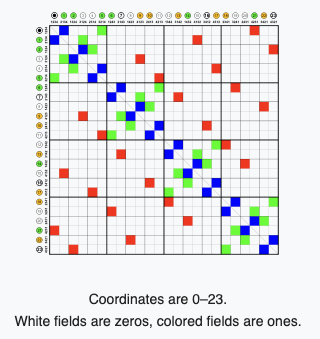
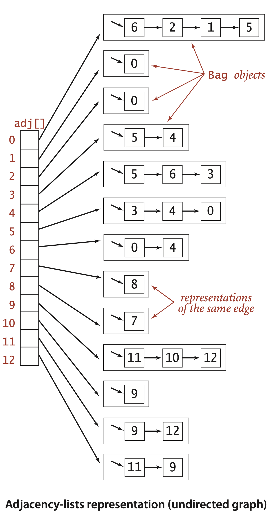

# Graph introduction

## Use cases

## Types of Graph models

There are many types of models in graph algorithms. The most important once are the following:

* **Undirected Graphs**
* **Directed Graphs**
* **Edge-Weighted Graphs**
* **Edge-Weighted Digraphs**

**Undirected Graphs** 
These types of graphs are a set of objects called vertices or nodes that are connected together, where all the edges are bidirectional, which means the connections could move both ways.

<a href="../../exercises/Graph/undirectional">Practical Example of the implementation</a>

**How to implement this api**
* We have two basic requirements, we must have the space to accommodate the types of grahps that we are likely to encoutner in applications. 
* We want to develop time-efficient implementations of Graph instance methods-the basic methods that we need to develop graph-processing clients.

The most known data structures:

An **adjacency matrix** is a matrix with V^2 that is a set of booleans that verify if the vertices are connected. The following example display the defenition. where 0 means false and 1 means true.

An **array of edges**, ses an Edge class with two instance variables of type int. Implementing such data structure defeats the second requirement specified above. because to find how many vertices are connected to a vertex, we would have to loop over the whole array. 

An **array of edges** is where we maintain a vertex-indexed array of lists of the vertices adjecent to each vertex. The following image demonstrate this data structure in an array. This data structure satisfy our requirements.

**Directed Graph**
These types of graphs are also a set of objects that are connected together, where all adges are direceted from one vertex to another. Not bidirectional like the undirected graphs. Edges can only move one way.

#### Name Conventions in Graph 

* **adjacent**: *when there is an edge connecting two vertices, we say that the vertices are adjacent to one another.*
* **incident**: *When there is an edge connecting two vertices,  we say that the edge is incident to both vertecies.*
* **subgrahp**: *is a subset of a graphs edges, that constitute a graph.*
* **path**: *In graph is a sequence of vertacies connected by edges.*
* **simple path**: *is one with no repeated vertices.*
* **cycle**: *is a path with atleast one edge whos first and last vertices are the same.*
* **length of a pair**: *is its number of edges.*
* **connected**: *if there is a path from every vertext to every other vertex in the graph, and the opposite is a set of subgraphs*.
* **asyclic graph**: *is a graph with no cycles*.
* **density**: *is the propertion of possible pairs of vertices that are connected by edges.*
* **sparse graph**: *has relative few of the possible edges present.*
* **dense graph**: *has relative few possible edges missing.*
* **bipartite graph**: *is a graph whose vertices we can divice into two sets such that all edges connect a vertex in one set with a vertex in the other set.*

* **forest**: *is a disjoint set og trees.*
* **spanning tree of a connected graph**: *is a subgraph that contains all of the graphs vertices and is a single tree.*
* **spanning forest of graphs**: *is the union of spanning trees of its connected components.*

### Tree properties 
A graph G with V vertices is a tree only if it satisfy the following properties.

* G has V-1 edges and no cycles.
* G has V-1 edges and is connected.
* G is connected, but removing any edge disconnect it.
* G is acyclic, but adding any edge creates a cycle.
* Exactly one simple path connects each pair of vertices in G.

